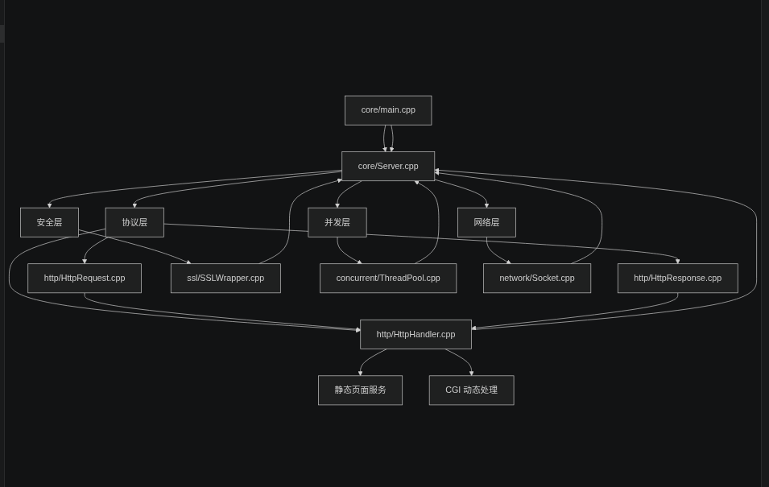
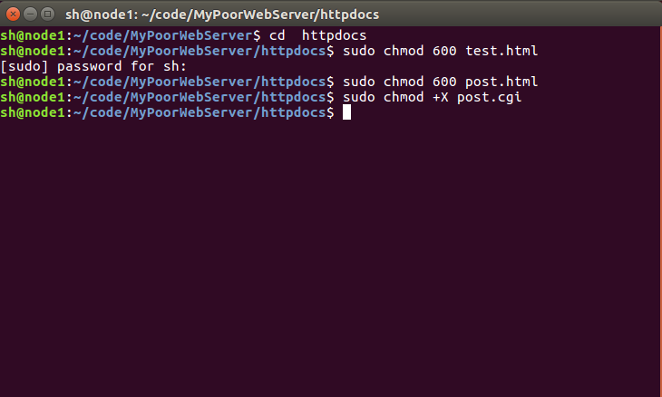
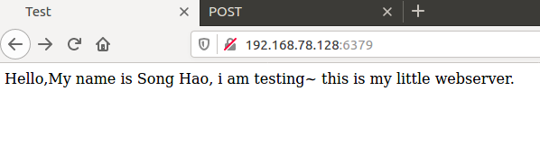
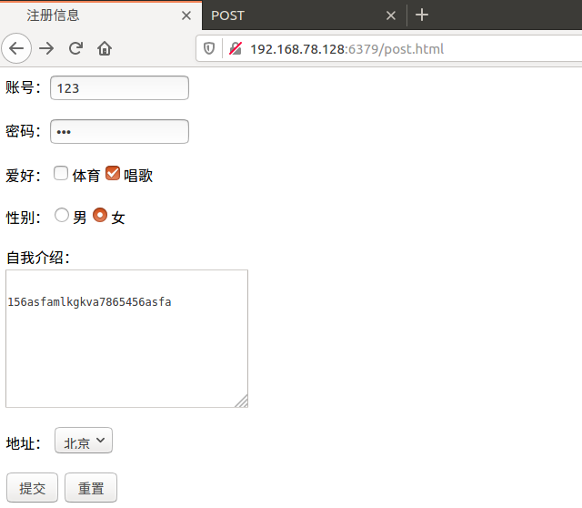
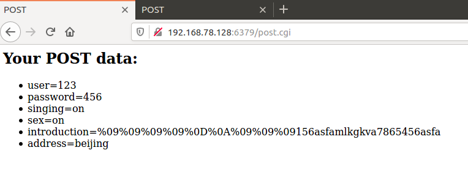
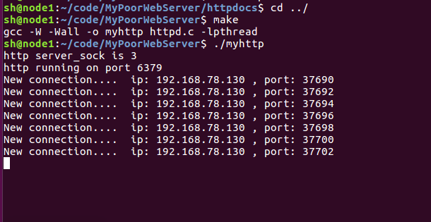
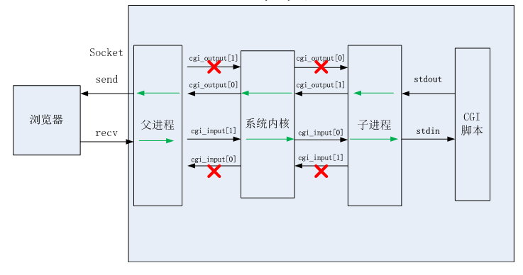

# PoorWebServer - 基于C++的工程级Web服务器

## 项目概述

基于C++从零实现工程级Web Server，覆盖TCP网络通信、HTTP协议解析、并发模型与HTTPS（TLS）安全传输等核心模块，完整实现从连接建立到请求响应的服务端处理流程。

## 主要特性

### 模块化架构
- **网络层**：基于Socket API实现TCP服务器，封装连接建立、监听、接收与关闭流程
- **协议层**：实现HTTP/1.1请求解析与响应生成机制，支持GET/POST方法、Header解析、状态码与静态资源访问
- **业务处理层**：支持CGI动态请求处理，基于fork/exec与管道机制实现服务端脚本执行与输出重定向

### 并发模型
- 构建线程池并发模型，避免"每连接一线程"问题，提高高并发场景下的稳定性与资源利用率

### 安全传输
- 集成OpenSSL实现HTTPS通信，完成TLS握手、证书加载与加密读写，保障数据传输安全

### 设计模式
- 综合运用RAII、工厂模式、线程池模式与代理思想，增强系统健壮性与工程可读性
- 通过封装Socket、HttpRequest、HttpResponse等核心组件，降低模块耦合度并提升代码复用性

## 编译与运行

### 依赖要求
- C++17编译器
- OpenSSL开发库
- POSIX兼容系统（Linux/macOS）

### 编译步骤
```bash
# 安装依赖（Ubuntu/Debian）
sudo apt update
sudo apt install libssl-dev

# 编译项目
make

# 运行HTTP服务器（默认端口8080）
./myhttp

# 运行HTTPS服务器
./myhttp --https --cert server.crt --key server.key --port 8443
```

### 命令行参数
- `--port <port>`: 指定监听端口（默认8080）
- `--https`: 启用HTTPS模式
- `--cert <file>`: HTTPS证书文件路径
- `--key <file>`: HTTPS私钥文件路径
- `--help`: 显示帮助信息

## 项目框架


## 项目结构

```
PoorWebServer/
├── core/                    # 核心模块
│   ├── main.cpp            # 主程序入口
│   ├── Server.hpp/cpp      # 服务器主类
├── network/                # 网络模块
│   ├── Socket.hpp/cpp      # Socket封装（RAII）
├── http/                   # HTTP协议模块
│   ├── HttpRequest.hpp/cpp # HTTP请求解析
│   ├── HttpResponse.hpp/cpp# HTTP响应生成
│   └── HttpHandler.hpp/cpp # HTTP请求处理
├── ssl/                    # SSL安全模块
│   └── SSLWrapper.hpp/cpp  # OpenSSL封装
├── concurrent/             # 并发模块
│   └── ThreadPool.hpp/cpp  # 线程池实现
├── cgi/                    # CGI处理模块
│   └── CGIHandler.hpp/cpp  # CGI脚本处理器
├── httpdocs/               # 静态文件目录
│   ├── index.html
│   ├── post.html
│   ├── post.cgi
│   └── test.html
├── image/                  # 图片资源
├── Makefile                # 构建脚本
├── README.md               # 项目文档
└── httpd.c                 # 原始C版本（参考）
```

## 架构图说明

本项目采用模块化分层架构，核心模块之间按职责分离：

- `core/`：服务入口和主调度，负责监听端口、接收连接、分发请求。
- `network/`：底层 Socket 封装，负责 TCP 连接创建、监听、接收、发送和关闭。
- `http/`：协议层，负责 HTTP 请求解析、HTTP 响应构建和请求处理逻辑。
- `concurrent/`：并发层，线程池负责将每个客户端连接交给工作线程执行。
- `ssl/`：安全层，OpenSSL 封装实现 HTTPS/TLS 加密传输。
- `cgi/`：动态内容层，CGI 脚本执行支持动态响应生成。

整体流程是：`core/main.cpp` 启动 `core/Server`，由 `Server` 调用 `network/Socket` 接受连接后，提交到 `concurrent/ThreadPool`，再交给 `http/HttpHandler` 处理；如果启用 HTTPS，则先通过 `ssl/SSLWrapper` 建立加密通道。

## 核心组件说明

### Socket类
使用RAII模式管理socket资源，支持TCP连接的建立、监听、接受和关闭操作。

### HttpRequest/HttpResponse类
- HttpRequest：解析HTTP请求行、headers和body
- HttpResponse：生成标准HTTP响应，支持多种状态码

### ThreadPool类
基于C++11实现的线程池，避免了传统"每连接一线程"的性能问题。

### SSLWrapper类
封装OpenSSL API，提供TLS握手、证书验证和加密通信功能。

### CGIHandler类
通过fork/exec执行CGI脚本，设置适当的环境变量并处理管道通信。

## 使用示例

### 启动HTTP服务器
```bash
./myhttp --port 8080
```

### 启动HTTPS服务器
```bash
# 生成自签名证书（测试用）
openssl req -x509 -newkey rsa:4096 -keyout server.key -out server.crt -days 365 -nodes

./myhttp --https --cert server.crt --key server.key --port 8443
```

### 测试CGI功能
访问 `http://localhost:8080/post.cgi` 执行CGI脚本。

## 设计模式应用

- **RAII模式**：Socket、SSL资源管理
- **工厂模式**：HttpResponse创建方法
- **线程池模式**：并发请求处理
- **代理模式**：SSLWrapper封装OpenSSL

## 性能特性

- 支持高并发连接（通过线程池）
- 低资源占用（避免线程爆炸）
- 模块化设计，便于扩展
- 安全的内存管理（RAII）

## 开发环境

- 语言：C++17
- 构建工具：GNU Make
- 网络库：POSIX Socket
- 加密库：OpenSSL
- 并发库：C++11标准库

## 许可证

本项目仅供学习和研究使用。
~~~

在进行sudo命令时，需要输入Linux下的sudo命令。

如下图所示：



如果忘记自己设置的sudo密码，可以按照如下教程进行密码重置：[sudo密码重置](https://blog.csdn.net/TravisPan/article/details/88682529?utm_medium=distribute.pc_aggpage_search_result.none-task-blog-2~aggregatepage~first_rank_v2~rank_aggregation-1-88682529.pc_agg_rank_aggregation&utm_term=linux%E5%BF%98%E8%AE%B0sudo%E5%AF%86%E7%A0%81&spm=1000.2123.3001.4430)

#### 2、编译执行

依次输入下述命令即可。

~~~c
cd  ../

make

./myhttp
~~~

#### 3、整体过程图


1、项目默认端口号是6379，如像下图地址栏所示，默认显示的界面是是test.html界面。

2、运行成功后默认显示的为test.html界面，同时同一路径下还有 post.html界面，可以将地址栏的“**test.html**”改成“**post.html**”来进行查看。










#### 4、整体框架图



#### 6、参考资料

《TCPIP网络编程》-韩国-尹圣雨

《Linux高性能服务器编程》-中国-游双

https://www.cnblogs.com/qiyeboy/p/6296387.html

https://www.jianshu.com/p/18cfd6019296
